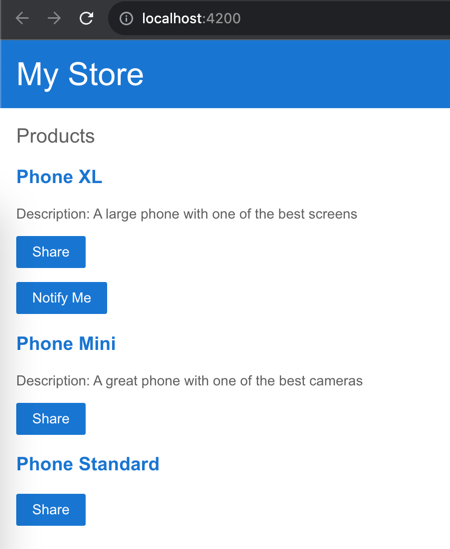

# Sample cypress project

# Run in Docker

````
./env.sh
````

# Run locally

````
nvm install 16.18.0
nvm use 16.18.0
npm run prepare

npm i
npm start
````

Then Open http://localhost:4200



Run cypress test

````
npm run cy:test-manage-login
````

Test

userway init
yarn userway scan OR npx userway scan
